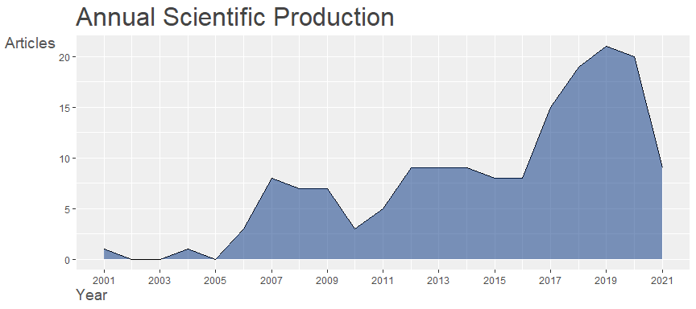

Análisis bibliométrico
================
Alejandro Platas López `alejandroplatasl@gmail.com`
2021-03-25

# Bibliometría

Los documentos se obtienen de la base de datos de **dimensions** con
diferentes queries relacionados con ABMS y Técnicas de Machine Learning.

Se descartan preprints y todo aquel documento que no tenga asociado un
Identificador de objeto digital (DOI por sus siglas en inglés).

## Principales resultados

    ## 
    ## 
    ## MAIN INFORMATION ABOUT DATA
    ## 
    ##  Timespan                              2001 : 2021 
    ##  Sources (Journals, Books, etc)        129 
    ##  Documents                             162 
    ##  Average years from publication        5.77 
    ##  Average citations per documents       10.49 
    ##  Average citations per year per doc    1.496 
    ##  References                            6475 
    ##  
    ## DOCUMENT TYPES                     
    ##  article               84 
    ##  book chapter          6 
    ##  conference paper      64 
    ##  review                8 
    ##  
    ## DOCUMENT CONTENTS
    ##  Keywords Plus (ID)                    1364 
    ##  Author's Keywords (DE)                483 
    ##  
    ## AUTHORS
    ##  Authors                               445 
    ##  Author Appearances                    482 
    ##  Authors of single-authored documents  16 
    ##  Authors of multi-authored documents   429 
    ##  
    ## AUTHORS COLLABORATION
    ##  Single-authored documents             18 
    ##  Documents per Author                  0.364 
    ##  Authors per Document                  2.75 
    ##  Co-Authors per Documents              2.98 
    ##  Collaboration Index                   2.98 
    ##  
    ## 
    ## Annual Scientific Production
    ## 
    ##  Year    Articles
    ##     2001        1
    ##     2004        1
    ##     2006        3
    ##     2007        8
    ##     2008        7
    ##     2009        7
    ##     2010        3
    ##     2011        5
    ##     2012        9
    ##     2013        9
    ##     2014        9
    ##     2015        8
    ##     2016        8
    ##     2017       15
    ##     2018       19
    ##     2019       21
    ##     2020       20
    ##     2021        9
    ## 
    ## Annual Percentage Growth Rate 11.61232 
    ## 
    ## 
    ## Most Productive Authors
    ## 
    ##    Authors        Articles Authors        Articles Fractionalized
    ## 1  TELLIDOU AC           6   TELLIDOU AC                     3.00
    ## 2  BAKIRTZIS AG          5   BAKIRTZIS AG                    2.50
    ## 3  ABDULKAREEM SA        4   NA NA                           2.00
    ## 4  AUGUSTIJN EW          4   NERI F                          2.00
    ## 5  FILATOVA T            3   THIELE JC                       1.50
    ## 6  MUSTAFA YT            3   TANG W                          1.25
    ## 7  ZHANG Y               3   LASKOWSKI M                     1.20
    ## 8  AN G                  2   AN G                            1.00
    ## 9  BAE JW                2   BOSSE S                         1.00
    ## 10 CARLEY KM             2   HLUCH L                         1.00
    ## 
    ## 
    ## Top manuscripts per citations
    ## 
    ##                                      Paper                                      DOI  TC TCperYear   NTC
    ## 1  RECKNAGEL F, 2001, ECOL MODEL                    10.1016/S0304-3800(01)00316-7   145      6.90  1.00
    ## 2  BROWN DG, 2013, CURR OPIN ENVIRON SUSTAINABILITY 10.1016/j.cosust.2013.07.012    105     11.67  6.65
    ## 3  LI G, 2012, APPL ENERGY                          10.1016/j.apenergy.2012.04.022   72      7.20  3.22
    ## 4  BUCKLEY CL, 2017, J MATH PSYCHOL                 10.1016/j.jmp.2017.09.004        66     13.20  6.97
    ## 5  TELLIDOU AC, 2007, IEEE TRANS POWER SYST         10.1109/TPWRS.2007.907533        63      4.20  4.58
    ## 6  CAVALCANTE IM, 2019, INT J INF MANAGE            10.1016/j.ijinfomgt.2019.03.004  61     20.33 12.08
    ## 7  THIELE JC, 2014, J STAT SOFTWARE                 10.18637/jss.v058.i02            55      6.88  4.95
    ## 8  LAMPERTI F, 2018, J ECON DYN CONTROL             10.1016/j.jedc.2018.03.011       47     11.75  6.92
    ## 9  LASKOWSKI M, 2009, PLOS ONE                      10.1371/journal.pone.0006127     47      3.62  2.94
    ## 10 GAZZOLA M, 2016, J FLUID MECH                    10.1017/jfm.2015.686             43      7.17  2.92
    ## 
    ## 
    ## Corresponding Author's Countries
    ## 
    ##           Country Articles   Freq SCP MCP MCP_Ratio
    ## 1  USA                  24 0.2087  19   5     0.208
    ## 2  GERMANY              10 0.0870   7   3     0.300
    ## 3  CANADA                8 0.0696   8   0     0.000
    ## 4  CHINA                 8 0.0696   4   4     0.500
    ## 5  AUSTRALIA             7 0.0609   6   1     0.143
    ## 6  GREECE                7 0.0609   7   0     0.000
    ## 7  ITALY                 6 0.0522   6   0     0.000
    ## 8  UNITED KINGDOM        6 0.0522   2   4     0.667
    ## 9  KOREA                 4 0.0348   4   0     0.000
    ## 10 NETHERLANDS           4 0.0348   1   3     0.750
    ## 
    ## 
    ## SCP: Single Country Publications
    ## 
    ## MCP: Multiple Country Publications
    ## 
    ## 
    ## Total Citations per Country
    ## 
    ##      Country      Total Citations Average Article Citations
    ## 1  USA                        372                     15.50
    ## 2  AUSTRALIA                  196                     28.00
    ## 3  GERMANY                    196                     19.60
    ## 4  GREECE                     127                     18.14
    ## 5  CANADA                     104                     13.00
    ## 6  CHINA                       79                      9.88
    ## 7  ITALY                       79                     13.17
    ## 8  UNITED KINGDOM              73                     12.17
    ## 9  SWITZERLAND                 70                     17.50
    ## 10 NETHERLANDS                 50                     12.50
    ## 
    ## 
    ## Most Relevant Sources
    ## 
    ##                                                                                                                          Sources       
    ## 1  LECTURE NOTES IN COMPUTER SCIENCE (INCLUDING SUBSERIES LECTURE NOTES IN ARTIFICIAL INTELLIGENCE AND LECTURE NOTES IN BIOINFORMATICS)
    ## 2  COMMUNICATIONS IN COMPUTER AND INFORMATION SCIENCE                                                                                  
    ## 3  ECOLOGICAL MODELLING                                                                                                                
    ## 4  PROCEEDINGS - WINTER SIMULATION CONFERENCE                                                                                          
    ## 5  ADVANCES IN INTELLIGENT SYSTEMS AND COMPUTING                                                                                       
    ## 6  JOURNAL OF ECONOMIC DYNAMICS AND CONTROL                                                                                            
    ## 7  PLOS ONE                                                                                                                            
    ## 8  APPLIED ENERGY                                                                                                                      
    ## 9  COMPUTATIONAL ECONOMICS                                                                                                             
    ## 10 COMPUTERS ENVIRONMENT AND URBAN SYSTEMS                                                                                             
    ##    Articles
    ## 1         8
    ## 2         5
    ## 3         4
    ## 4         4
    ## 5         3
    ## 6         3
    ## 7         3
    ## 8         2
    ## 9         2
    ## 10        2
    ## 
    ## 
    ## Most Relevant Keywords
    ## 
    ##    Author Keywords (DE)      Articles Keywords-Plus (ID)     Articles
    ## 1     REINFORCEMENT LEARNING       32 COMPUTATIONAL METHODS        66
    ## 2     AGENT-BASED MODELING         20 REINFORCEMENT LEARNING       64
    ## 3     MACHINE LEARNING             19 AUTONOMOUS AGENTS            59
    ## 4     AGENT-BASED SIMULATION       13 AGENT-BASED MODEL            46
    ## 5     AGENT-BASED MODEL            10 MACHINE LEARNING             43
    ## 6     SIMULATION                   10 LEARNING SYSTEMS             35
    ## 7     AGENT-BASED MODELS            7 LEARNING ALGORITHMS          32
    ## 8     AGENT-BASED MODELLING         6 AGENT BASED SIMULATION       28
    ## 9     ELECTRICITY MARKETS           6 SIMULATION PLATFORM          25
    ## 10    LEARNING                      6 DECISION MAKING              24

## Productividad global

<!-- --><!-- -->

## Productividad Anual

<!-- -->

## Citas por año

<!-- -->

## Artículos más citados

<table class="table" style="font-size: 18px; margin-left: auto; margin-right: auto;">

<tbody>

<tr>

<td style="text-align:left;">

SUTTON, R.S., BARTO, A.G., (1998) REINFORCEMENT LEARNING: AN
INTRODUCTION, , CAMBRIDGE, MA: MIT PRESS

</td>

<td style="text-align:right;">

4

</td>

</tr>

<tr>

<td style="text-align:left;">

SUTTON, R.S., BARTO, A.G., (1998) REINFORCEMENT LEARNING: AN
INTRODUCTION, , MIT PRESS, CAMBRIDGE

</td>

<td style="text-align:right;">

4

</td>

</tr>

<tr>

<td style="text-align:left;">

WATKINS, C.J.C.H., DAYAN, P., TECHNICAL NOTE: Q-LEARNING (1992) MACHINE
LEARNING, 8, PP. 279-292

</td>

<td style="text-align:right;">

4

</td>

</tr>

<tr>

<td style="text-align:left;">

TESFATSION, L., AGENT-BASED COMPUTATIONAL ECONOMICS: GROWING ECONOMIES
FROM THE BOTTOM UP (2002) ARTIFICIAL LIFE, 8 (1), PP. 55-82

</td>

<td style="text-align:right;">

3

</td>

</tr>

<tr>

<td style="text-align:left;">

AN, L., MODELING HUMAN DECISIONS IN COUPLED HUMAN AND NATURAL SYSTEMS:
REVIEW OF AGENT-BASED MODELS (2012) ECOLOGICAL MODELLING, 229, PP. 25-36

</td>

<td style="text-align:right;">

2

</td>

</tr>

<tr>

<td style="text-align:left;">

ANDERSON, P.W., MORE IS DIFFERENT (1972) SCIENCE, 177 (4047), PP.
393-396

</td>

<td style="text-align:right;">

2

</td>

</tr>

<tr>

<td style="text-align:left;">

BONABEAU, E., AGENT-BASED MODELING: METHODS AND TECHNIQUES FOR
SIMULATING HUMAN SYSTEMS (2002) PROCEEDINGS OF THE NATIONAL ACADEMY OF
SCIENCES, 99, PP. 7280-7287

</td>

<td style="text-align:right;">

2

</td>

</tr>

<tr>

<td style="text-align:left;">

BONE, C., DRAGICEVIC, S., WHITE, R., MODELING-IN-THE-MIDDLE: BRIDGING
THE GAP BETWEEN AGENT-BASED MODELING AND MULTI-OBJECTIVE DECISION-MAKING
FOR LAND USE CHANGE (2011) INTERNATIONAL JOURNAL OF GEOGRAPHICAL
INFORMATION SCIENCE, 25 (5), PP. 717-737

</td>

<td style="text-align:right;">

2

</td>

</tr>

<tr>

<td style="text-align:left;">

BRAMBILLA, M., FERRANTE, E., BIRATTARI, M., DORIGO, M., SWARM ROBOTICS:
A REVIEW FROM THE SWARM ENGINEERING PERSPECTIVE (2013) SWARM
INTELLIGENCE, 7 (1), PP. 1-41

</td>

<td style="text-align:right;">

2

</td>

</tr>

<tr>

<td style="text-align:left;">

CHAHARSOOGHI, S.K., HEYDARI, J., ZEGORDI, S.H., A REINFORCEMENT LEARNING
MODEL FOR SUPPLY CHAIN ORDERING MANAGEMENT: AN APPLICATION TO THE BEER
GAME (2008) DECISION SUPPORT SYSTEMS, 45 (4), PP. 949-959

</td>

<td style="text-align:right;">

2

</td>

</tr>

</tbody>

</table>

## Primeros autores más citados

<table class="table" style="font-size: 22px; margin-left: auto; margin-right: auto;">

<tbody>

<tr>

<td style="text-align:left;">

TESFATSION L

</td>

<td style="text-align:right;">

49

</td>

</tr>

<tr>

<td style="text-align:left;">

GRIMM V

</td>

<td style="text-align:right;">

47

</td>

</tr>

<tr>

<td style="text-align:left;">

BARTO A G

</td>

<td style="text-align:right;">

39

</td>

</tr>

<tr>

<td style="text-align:left;">

SUTTON R S

</td>

<td style="text-align:right;">

36

</td>

</tr>

<tr>

<td style="text-align:left;">

AN G

</td>

<td style="text-align:right;">

30

</td>

</tr>

<tr>

<td style="text-align:left;">

MACAL C M

</td>

<td style="text-align:right;">

30

</td>

</tr>

<tr>

<td style="text-align:left;">

EREV I

</td>

<td style="text-align:right;">

29

</td>

</tr>

<tr>

<td style="text-align:left;">

ROTH A E

</td>

<td style="text-align:right;">

29

</td>

</tr>

<tr>

<td style="text-align:left;">

ROVENTINI A

</td>

<td style="text-align:right;">

29

</td>

</tr>

<tr>

<td style="text-align:left;">

FRISTON K J

</td>

<td style="text-align:right;">

27

</td>

</tr>

</tbody>

</table>

## Productividad a lo largo del tiempo

<!-- -->

# Co-citación por Revista

<!-- -->

## Co-ocurrencia de palabras clave

<!-- -->

## Colaboración de autores

<!-- -->

## Colaboración de Universidad

<!-- -->

# Análisis de términos

<!-- -->

## Análisis de términos

<!-- -->

## Análisis de términos

<!-- -->

## Análisis de términos

<!-- -->
